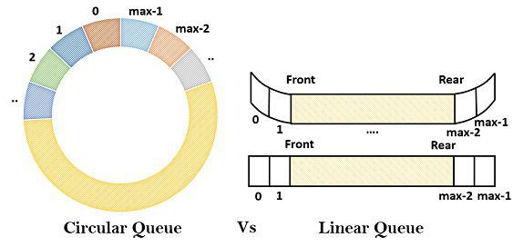
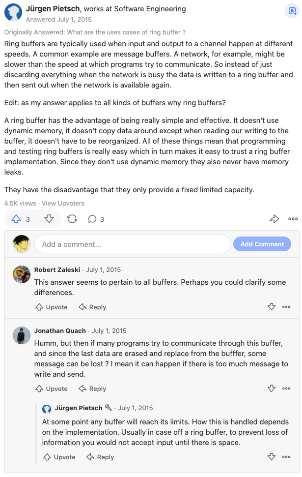

# ringbuffer 阅读版 

源码阅读版 (带着问题去读源码) 。

A circular buffer (ring buffer) in Go, implemented io.ReaderWriter interface

# Sched   

- [x] ringbuffer 基本概念及使用场景  
- [x] ringbuffer 的数据结构     

# Q&A 

## ringbuffer 基本概念及使用场景  

生产者生产过快，消费者消费过慢。 这时候势必有一堆已经生产了，但还没被消费的数据堆积在生产者那里。 这时候怎么办呢？ 
 
1. 开启多个消费者 worker 来共同处理这些数据。   
2. 把堆积数据暂时存储在一个 "缓冲区" 里，生产者把生产的数据丢到缓冲区，消费者从缓冲区拿数据。

一般用 "队列" 的数据结构来实现一个缓冲区，满足 fifo。 而 ringbuffer 就是这样的一个队列，只不过它是一个 "循环队列"。 

Ringbuffer 可以看成是数据结构中 "循环队列" 在真实应用中的实现。 只是把 "循环队列" 应用到实际中，有许多丰富场景，例如并发场景等。 

在实际应用中使用循环队列作为一个存储结构，就不得不考虑更多问题，例如： 

* 循环队列满了怎么办？ 能自动扩容吗？ 还是我一开始就把循环队列的 size 初始化得巨大？ 还是直接覆盖旧数据？ 
* 并发场景下怎么保证读写安全？  
* 效率如何？ 可以提高效率吗？    
* ...  

## # 为什么 buffer 使用的队列要用环形的？ 

上面说到 buffer 常用 queue 的数据结构来实现。 **循环队列** 相较于普通的 **线性队列** 有什么优点呢？ 

当生产者效率实在太高，消费者消费能力实在太低。 缓冲区也可能会被撑爆了。 所以可以考虑：

* 对循环队列扩容   
* 新生产的数据覆盖掉队列总 **最老** 的数据，把最老的数据丢掉。

TODO think:
 
 * Golang 里的 channel 可以设定 buffer，本质也是用一个队列来存储数据。为什么不用循环队列呢？  Go channel 的 buffer size 最多也就 1<<16(见 makechan())。 
 * bytes.Buffer 创建了一个缓冲器，是怎么实现的呢？   

## ringbuffer 近义词？  

ringbuffer、circular buffer、循环队列    

## famous usage       

* 网卡收到的包会临时存储在缓冲区(ring buffer)，所以buffer满了可能会把包丢掉  
* disruptor  
* kfifo(linux kernel 里的一个结构体)  
* hadoop   
* ... 

## 该 repo ringbuffer 实现了哪些 interface ? 

- io.Reader  
- io.Writer  
- io.ByteReader  
- io.ByteWriter
- io.StringWriter

## ringbuffer 如何判空/判满？

[维基百科 : 环形缓冲器](https://zh.wikipedia.org/wiki/%E7%92%B0%E5%BD%A2%E7%B7%A9%E8%A1%9D%E5%8D%80) 里介绍了一些。 

* 计数器 : (在 RingBuffer 里追加一个 counter，优点是判断简单，缺点是要为此维护一个锁；)   
* 给 ringbuffer 故意留一个存储单元，不存储数据，而是用于做空or满的判断。 pread == pwrite 说明buffer为空，pwrite 相邻且落后 pread 一个位置说明 buffer 为满。 (其实数据结构中 "循环队列" 判空/满就学过了)   
* 记录最后操作 : 当 pread == pwrite，如果最后一次操作是读则 buffer 为空，否则为满。  
* ...    

数据结构中 "循环队列" 章节有讲到一些，有空可以去看看。 

## ringbuffer 的优势？ 效率更高，性能更优？  

根据 [What are the uses cases of ring buffer?](https://www.quora.com/What-are-the-uses-cases-of-ring-buffer) 下的一个回答： 

* buffer 里的旧数据如果成为负担，并且丢掉一部分也无关紧要，那么此时使用循环队列就比普通的队列操作起来更简单方便。

## 其他 ringbuffer 实现 

* allenxuxu/ringuffer - 实现了一个可自动扩容的 ringbuffer   
* panjf2000/gnet 里的 ringbuffer - 也可以扩容。并且看起来像是参考了 linux kernel 里的 kfifo (buffer size 必须是2的n次幂，结构体里用了一个 bit mask ...)  

## TODO  

* ringbuffer、lock-free、spinlock、cas   
* newvnc 使用 channel buffer 缓冲，丢图?   
* ringbuffer 多了 2次copy, 会有 syscall 负担? 见 [Recv ring buffer vs simple buffer](https://stackoverflow.com/questions/9774925/recv-ring-buffer-vs-simple-buffer) 。 

